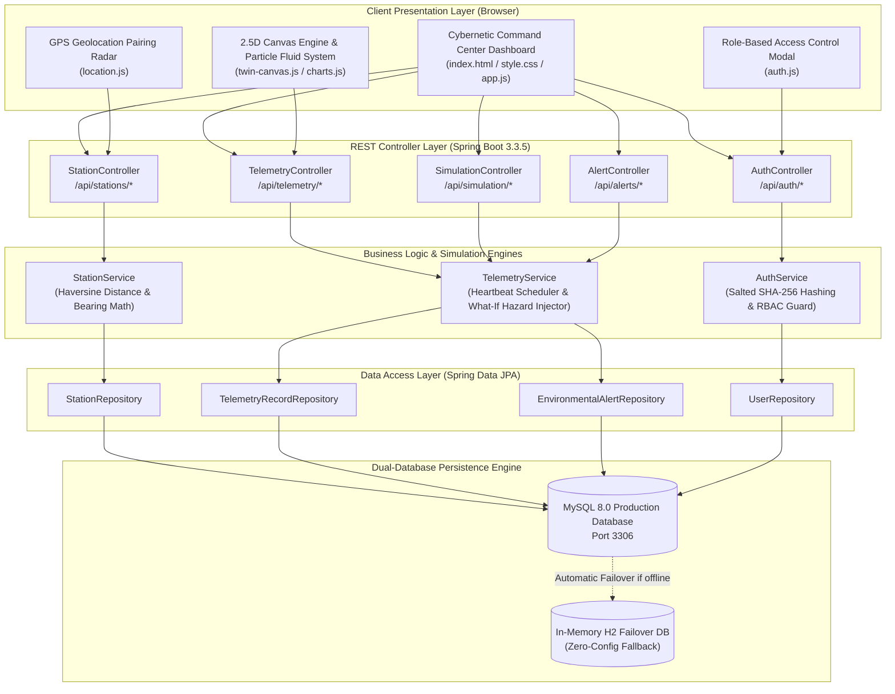
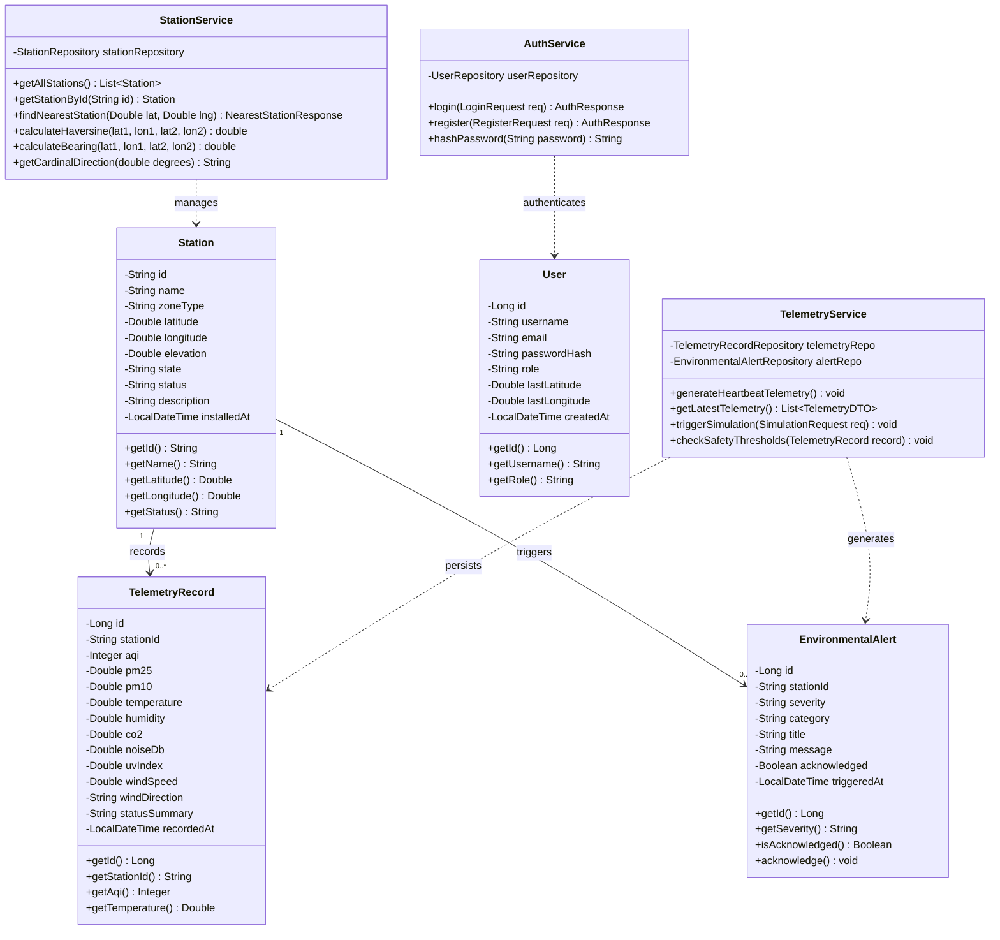
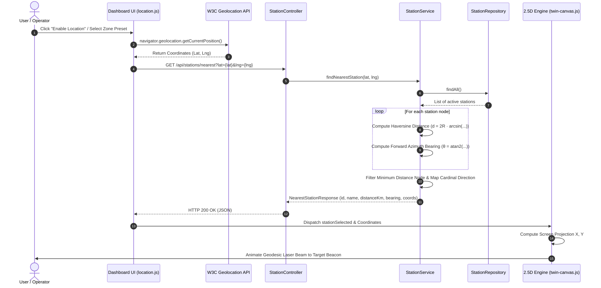
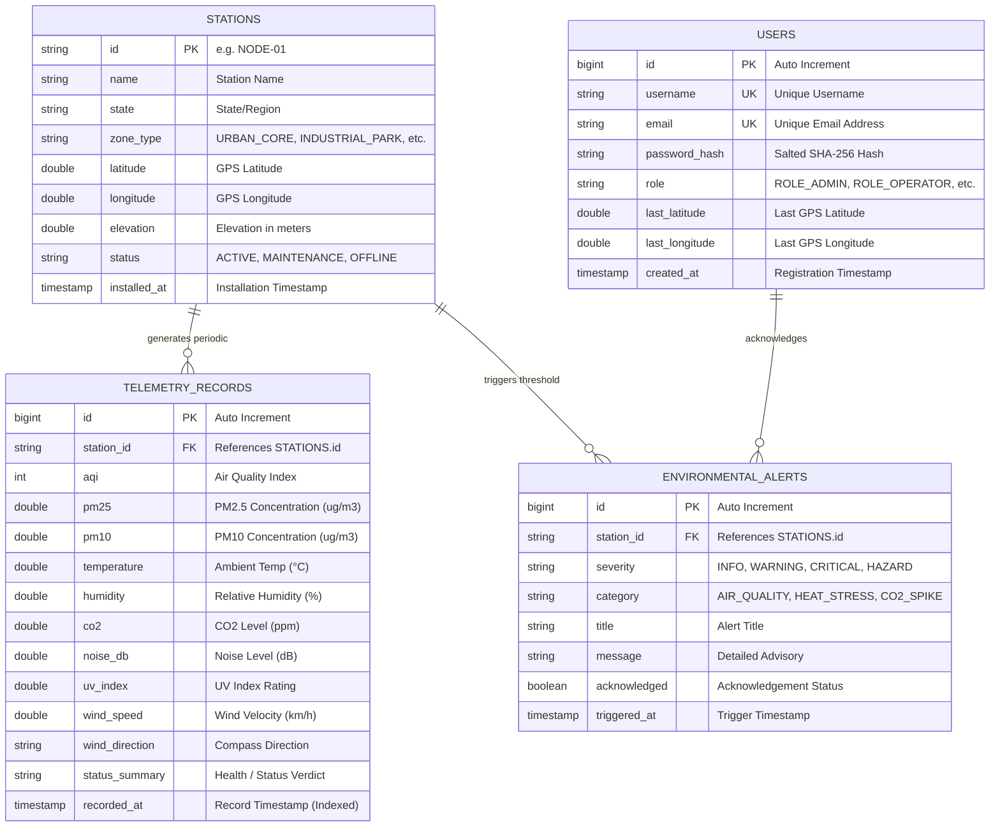

# AETHERIS: Real-Time 2.5D Digital Environment Twin System

---

## Week 1

## Project Administration

* **Project Title:** AETHERIS — Real-Time 2.5D Digital Environment Twin for Microclimate Tracking & Hazard Simulation
* **Domain:** Environmental Informatics, Cybernetic Simulation & Geospatial Computing
* **Technology Stack:** Java 17, Spring Boot 3.3.5, Spring Data JPA, MySQL 8.0, In-Memory H2, HTML5 Canvas 2D, Vanilla JavaScript, CSS3 Glassmorphism

### Team Members

| Name | Enrollment | Email | Mobile |
| :--- | :--- | :--- | :--- |
| **Devansh Joshi** | 24E1ARADM40P039 | devanshjoshi980@gmail.com | 7597934912 |
| **Devansh Mittal** | 24E1ARADM40P041 | devanshmittal308@gmail.com | 6375536662 |
| **Dhruv Jain** | 24E1ARADM40P043 | dhruvtorawat5555@gmail.com | 8239361149 |
| **Garv Kumar** | 24E1ARADM40P049 | garvmittal94068@gmail.com | 7412894068 |
| **Ishita Sinha** | 24E1ARADF40P063 | ishsinha1106@gmail.com | 9241970138 |

### Module Ownership & Primary Responsibilities

| Name | Role / Domain | Project Module | Primary Responsibilities |
| :--- | :--- | :--- | :--- |
| **Devansh Joshi** | Backend Engineer | Geospatial & Location Services | Spherical Trigonometry, Haversine Distance Formula, Forward Azimuth Bearing, Geolocation REST APIs |
| **Ishita Sinha** | Frontend Engineer | Canvas 2.5D & Graphics Engine | 2.5D Isometric Terrain, 90+ Atmospheric Particle Fluid Engine, Custom Cubic Bézier Spline Charts |
| **Dhruv Jain** | UI/UX Engineer | Command Center & Dashboard | Cybernetic Glassmorphism UI, Responsive CSS Grid, 8 Live KPI Telemetry Cards, Region Filters |
| **Devansh Mittal** | Backend Engineer | Simulation & Alerting Engine | Weighted Random Walk Sensor Drift, 4 "What-If" Hazard Scenarios, Automated EPA Safety Alert Rules |
| **Garv Kumar** | Database Engineer | Architecture & Security | 3NF MySQL Relational Schema, Spring Data JPA Repositories, Salted SHA-256 Auth & RBAC Security |

---

## Abstract

Rapid urbanization and escalating industrialization have created volatile urban microclimates, characterized by localized heat islands, sudden particulate surges (PM2.5 / PM10), and dangerous greenhouse gas concentrations. Traditional environmental monitoring platforms remain fragmented—presenting static numeric spreadsheets or flat GIS maps that fail to convey dynamic atmospheric dispersion, directional drift, and real-time community impact.

**AETHERIS** introduces a distributed, full-stack **Digital Environment Twin System** engineered to bridge the gap between complex atmospheric science and real-time operational decision-making. Operating on a robust **Java Spring Boot 3.3.5** backend coupled with an interactive **HTML5 Canvas 2.5D visual engine**, the platform models living urban microclimates with continuous 6-second telemetry streams. The system integrates advanced spherical trigonometry—utilizing the **Haversine Great-Circle Distance Formula** and **Forward Azimuth Bearing** equations—to calculate the exact distance and compass orientation from any user's device to the nearest monitoring beacon, projecting a dynamic geodesic laser beam across the 2.5D terrain grid.

To move beyond passive observation into proactive risk management, AETHERIS features a mathematical **'What-If' Disaster Simulation Engine**. Operators can inject synthetic environmental disturbances—such as Extreme Heatwaves, Industrial Emission Surges, and Atmospheric Cleansing Storms—modeled via weighted smooth random walk algorithms. The visual digital twin reacts instantaneously: radial air quality halos dynamically swell, thermal gradient heatmaps adjust color spectrums from cyan to crimson, and automated threshold watchers trigger real-time hazard alerts whenever EPA limits are breached. Secured with salted SHA-256 password hashing and Role-Based Access Control (RBAC), and fortified with a dual-database architecture featuring automatic failover to an in-memory H2 database, AETHERIS delivers a resilient, audit-ready command center for smart municipalities, industrial parks, and ecological reserves.

---

## Week 2

## User Roles (Role-Based Access Control)

AETHERIS enforces strict Role-Based Access Control (RBAC) at the Spring Boot REST API layer to govern access across administrative, operational, and research capabilities:

* **System Administrator (`ROLE_ADMIN`)**:
  * Full administrative privileges across the entire environment twin platform.
  * Authorized to dynamically register, update, and deactivate physical and virtual monitoring stations via `/api/stations`.
  * Can inject and clear global 'What-If' hazard simulations (`HEATWAVE`, `INDUSTRIAL_EMISSION`, `RAIN_CLEANSING`, `NORMAL`).
  * Manages operator credentials and oversees system audit logs.

* **Lead Operator (`ROLE_OPERATOR`)**:
  * Frontline monitoring personnel assigned to environmental command centers.
  * Authorized to trigger calibrated disaster simulation drills to test emergency response protocols.
  * Can inspect active threshold breaches and formally acknowledge critical hazard alerts via `/api/alerts/{id}/acknowledge`.

* **Environmental Researcher (`ROLE_RESEARCHER`)**:
  * Academic and municipal analysts inspecting long-term atmospheric health trends.
  * Access to real-time telemetry feeds and historical time-series pagination queries (`/api/telemetry/history/{id}`).
  * Authorized to generate certified ISO 14001:2015 environmental audit compliance reports.

* **Guest Citizen / Public Viewer (`ROLE_GUEST`)**:
  * Unauthenticated or public users accessing localized air quality intelligence.
  * View-only access to nearest station telemetry, overall Clean Air Scores (0–100), and plain-English daily health advisories.

---

## Architecture & Core Modules

The AETHERIS system operates as a decoupled, multi-tiered architecture with a central Spring Boot Java application serving both REST API endpoints and static cybernetic client resources.



### Functional Modules

* **Module 1: Geospatial Proximity & Geolocation Services** (*Devansh Joshi*)
  * Integrates the W3C Browser Geolocation API with backend spherical trigonometry algorithms.
  * Computes Great-Circle Distance using the Haversine formula ($R = 6371\text{ km}$) and calculates Forward Azimuth compass bearing angles.
  * Exposes `/api/stations/nearest` to resolve closest sensor nodes and return human-readable distance metrics (meters or kilometers).

* **Module 2: 2.5D Isometric Canvas & Atmospheric Fluid Engine** (*Ishita Sinha*)
  * Custom HTML5 Canvas rendering pipeline executing at a locked 60 FPS via `requestAnimationFrame`.
  * Simulates 90+ concurrent atmospheric wind and particulate vectors with variable velocity ($v_x, v_y$), lifespan decay, and screen boundary wrapping.
  * Powers 3 switchable visual modes: Air Quality Dispersion Halos, Ambient Thermal Heatmap, and Radar Proximity Sweep.
  * Lightweight cubic Bézier spline interpolation in `charts.js` for smooth real-time telemetry curves.

* **Module 3: Cybernetic Command Dashboard & Telemetry Visualization** (*Dhruv Jain*)
  * Futuristic dark-mode glassmorphism interface styled via CSS custom variables (`:root` tokens in `style.css`).
  * 8 core telemetry KPI display cards (AQI, Temperature, Relative Humidity, $\text{CO}_2$, PM2.5, PM10, Noise dB, UV Index, Wind Speed & Direction).
  * State and regional dropdown filter controls with real-time UI notification banners for threshold hazards.
  * Central client orchestrator (`app.js`) running a non-blocking 5-second asynchronous polling loop.

* **Module 4: Background Simulation Heartbeat & Hazard Injection Engine** (*Devansh Mittal*)
  * Spring `@Scheduled(fixedRate = 6000)` background scheduler breathing organic variation into all 9 environmental parameters.
  * Weighted Smooth Random Walk algorithm ($\text{Value}_t = 0.85 \cdot \text{Value}_{t-1} + 0.15 \cdot \text{Baseline} + \Delta_{\text{random}}$) tailored across 4 distinct environmental zones (*Urban Core, Industrial Park, Forest Reserve, Coastal Basin*).
  * Interactive "What-If" scenarios (`HEATWAVE`, `INDUSTRIAL_EMISSION`, `RAIN_CLEANSING`, `STORM_FRONT`, `NORMAL`) with intensity multipliers and automatic alert creation.
  * Simulation requests validate scenario names, station IDs, intensity bounds (0.5–2.5), and positive durations; unknown target stations return a not-found response.

* **Module 5: Relational Persistence & Security Infrastructure** (*Garv Kumar*)
  * 3NF normalized relational schema managing users, stations, telemetry records, and hazard alerts.
  * Spring Data JPA entity mapping with high-performance composite indexing on `station_id` and `recorded_at`.
  * Resilient dual-database strategy via `DataSourceConfig.java` providing zero-config automatic failover to H2 in-memory storage.
  * Salted SHA-256 password hashing and role authorization protecting administrative operations.

---

## Database Architecture & Resiliency Strategy

The system implements a resilient database strategy that guarantees zero runtime interruption, accommodating both enterprise production deployments and standalone local evaluations.

### MySQL 8.0 (Production Relational Core)
* **Usage**: Persistent storage of user accounts, station registry, time-series telemetry records, and alert audit logs.
* **Schema Definition**: Authored in [`database/schema.sql`](file:///e:/digital%20twin%20system/database/schema.sql) with utf8mb4 encoding, foreign keys, and default values.
* **Indexing Strategy**: Time-series B-Tree composite indexes on `(station_id, recorded_at DESC)` ensuring $O(\log N)$ retrieval for real-time dashboards and historical queries.

### In-Memory H2 Database (Zero-Config Automatic Fallback)
* **Usage**: Transparent failover engine activated automatically when MySQL Server is unreachable.
* **Implementation**: Managed by `DataSourceConfig.java`, which attempts a connection to MySQL on port 3306; upon connection timeout, it dynamically spins up an in-memory H2 database.
* **Auto-Seeding**: `DataInitializer.java` automatically seeds 6 default monitoring stations (`NODE-01` to `NODE-06`), initial telemetry history, and standard demo accounts on startup.

---

## Non-Functional Requirements

* **Performance**:
  * Sub-millisecond execution for spherical Haversine distance and compass bearing calculations.
  * Canvas rendering pipeline maintains a locked 60 FPS at native device pixel ratio (HiDPI/Retina display scaling) with sub-16ms frame times.
  * Dashboard polling payload resolves across all active stations in under 150ms.
* **Security**:
  * Passwords encrypted with salted SHA-256 before persistence; no plain-text credentials stored.
  * Role-Based Access Control guards administrative endpoints (station registration and hazard simulation).
  * Cross-Origin Resource Sharing (CORS) policy configured in `CorsConfig.java` to prevent unauthorized cross-domain exploitation.
* **Fault Tolerance & Resilience**:
  * Seamless database failover: Application starts and runs cleanly with or without a live MySQL instance.
  * Client-side geolocation fallback: Automatically provides predefined regional coordinates if the user denies GPS permissions or uses a browser without native GPS sensors.
* **Scalability & Code Quality**:
  * Decoupled layered architecture (Controller $\rightarrow$ Service $\rightarrow$ Repository $\rightarrow$ Database).
  * Vanilla JavaScript frontend without heavy external UI frameworks ensures instant loading and zero build-step overhead.

---

## Week 3

---
### UML Design & System Modeling
---

### 1. UML Class Diagram (Domain Model & Services)



---

### 2. UML Sequence Diagram (GPS Pairing & Geodesic Ray Cast Flow)



---

### 3. Entity-Relationship (ER) Diagram (3NF Normalized Schema)



---

## 🚀 Quick Start & Execution

### 1. Run the Spring Boot Application
The project includes the Maven Wrapper (`mvnw.cmd`), requiring only Java 17.

```powershell
cd "e:\digital twin system\backend"
.\mvnw.cmd spring-boot:run
```

- Application Server: **`http://localhost:9090`**
- Both the REST APIs and the 2.5D Digital Twin frontend are served simultaneously on port `9090`.

### 2. Default Access Credentials

| Role | Username / Email | Password | Access Level |
|---|---|---|---|
| **System Administrator** | `admin` / `admin@twin.env` | `admin123` | Full node creation, scenario injection |
| **Lead Operator** | `operator` / `operator@twin.env` | `operator123` | Simulation drills, alert resolution |

---

## 📡 REST API Reference

| Method | Endpoint | Description |
|---|---|---|
| `POST` | `/api/auth/login` | Authenticate user and return session token |
| `POST` | `/api/auth/register` | Register new user account |
| `GET` | `/api/auth/me` | Fetch currently logged-in user profile |
| `GET` | `/api/stations` | List all environmental monitoring stations |
| `GET` | `/api/stations/{id}` | Inspect single station details |
| `POST` | `/api/stations` | Register new physical or virtual sensor node |
| `GET` | `/api/stations/nearest?lat={lat}&lng={lng}` | Haversine distance, bearing, and nearest station pairing |
| `GET` | `/api/telemetry/live` | Stream live telemetry across all active stations |
| `GET` | `/api/telemetry/history/{stationId}` | Fetch historical time-series telemetry records |
| `POST` | `/api/simulation/trigger` | Inject scenario (`HEATWAVE`, `INDUSTRIAL_EMISSION`, `RAIN_CLEANSING`, `STORM_FRONT`, `NORMAL`) |
| `GET` | `/api/alerts` | Fetch threshold hazard alerts (`?unacknowledgedOnly=true`) |
| `POST` | `/api/alerts/{id}/acknowledge` | Acknowledge active hazard alert |

---

## 📁 Project Directory Structure

```text
digital twin system/
├── database/
│   └── schema.sql                  # MySQL database schema script & index definitions
├── frontend/                       # Client web application
│   ├── index.html                  # Cybernetic Digital Twin command center UI
│   ├── css/
│   │   └── style.css               # Dark-mode glassmorphism design tokens & styles
│   └── js/
│       ├── app.js                  # Main dashboard orchestrator & 5s polling loop
│       ├── auth.js                 # Authentication, role badges, and session storage
│       ├── location.js             # On-screen GPS pairing popup & coordinate helpers
│       ├── twin-canvas.js          # 2.5D isometric atmospheric terrain & particle fluid engine
│       └── charts.js               # Lightweight cubic Bézier spline curve charting
├── backend/                        # Java Spring Boot 3.3.5 Backend Service
│   ├── pom.xml                     # Maven project configuration & dependencies
│   ├── mvnw.cmd                    # Maven wrapper executable
│   └── src/main/
│       ├── java/com/digitaltwin/environment/
│       │   ├── EnvironmentTwinApplication.java
│       │   ├── config/             # CORS, DataInitializer, SecurityHelper, DataSourceConfig
│       │   ├── model/              # Station, TelemetryRecord, EnvironmentalAlert, User
│       │   ├── repository/         # Spring Data JPA repositories
│       │   ├── dto/                # Auth, Telemetry, Simulation, NearestStation DTOs
│       │   ├── service/            # StationService, TelemetryService, AuthService
│       │   └── controller/         # Station, Telemetry, Simulation, Alert, Auth Controllers
│       └── resources/
│           ├── application.properties
│           └── static/             # Static frontend distribution served by Spring Boot
└── README.md                       # Comprehensive Project Documentation
```
