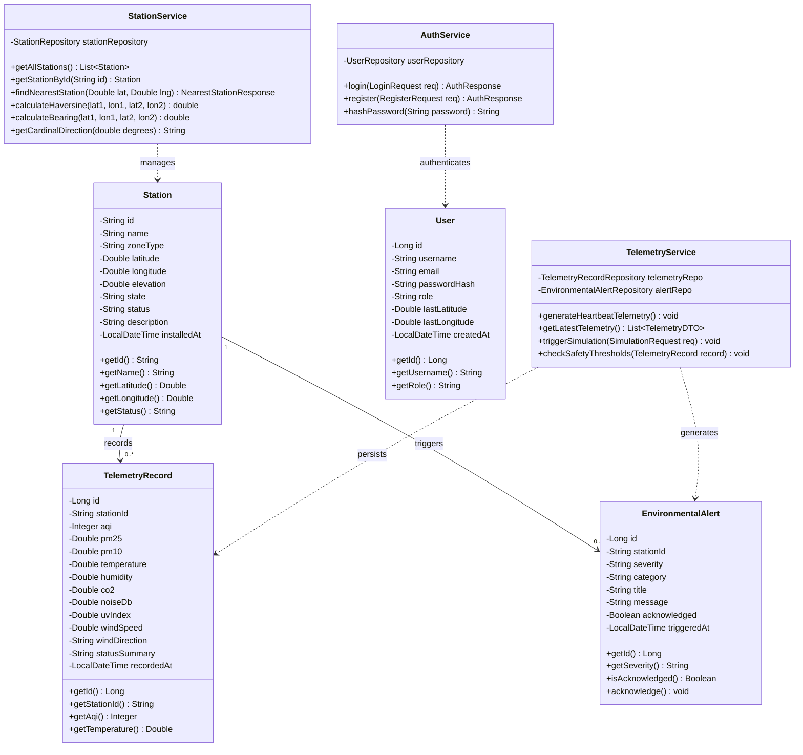
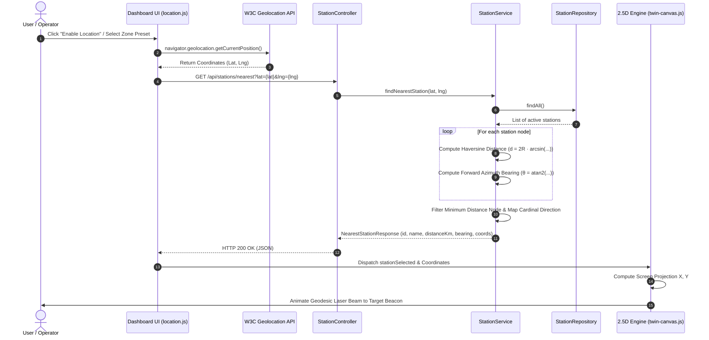

# AETHERIS — Digital Environment Twin System

A full-stack, real-time **100% Software-Powered Digital Environment Twin System** designed for monitoring urban microclimates, industrial particulate dispersion, and ecological bio-reserves with **zero hardware and zero IoT devices required**. The system couples an interactive **HTML5 Canvas 2.5D atmospheric fluid simulation twin** with a **Java Spring Boot backend**, **MySQL database**, secure **JWT/session authentication**, and **browser geolocation proximity pairing**.

---

## 🌟 Key Features & SaaS Product Suite

1. **3-in-1 Universal Experience Architecture**:
   - **🌐 Product Showcase & Solutions Landing Page**:
     - High-converting, modern SaaS product presentation with hero section, live telemetry trust metrics, and an interactive mini-twin sandbox widget.
     - 4 Core Product Pillars: 2.5D Atmospheric Fluid Simulation, Sub-10m GPS Geodesic Radar Sync, AI 'What-If' Hazard Injection, and Automated ESG Compliance.
     - Interactive Industry Use Cases: Smart Municipalities, Heavy Industry, Ecological Bio-Reserves, and Corporate Campuses.
     - Transparent SaaS Pricing Tiers: Community (₹0), Smart Business Pro (₹299/mo annual / ₹399/mo), and Metropolis Sovereign (₹999/mo annual / ₹1,299/mo) with interactive billing cycle toggle and GST compliance.
     - 100% Zero-Hardware Model: Eliminates all physical IoT sensor deployments, microcontrollers, and field maintenance by synthesizing meteorological models, satellite feeds, and mathematical fluid dynamics.
     - Testimonials, Enterprise Security badges (ISO 14001, EPA AirNow, SOC-2, AES-256), and interactive FAQ accordion.
   - **🌿 Citizen & Business Friendly Dashboard**:
     - Clean, human-first environmental intelligence designed for citizens, schools, and business operators.
     - **Clean Air Score**: Animated SVG circular progress dial displaying an overall cleanliness score (0 to 100).
     - **Dynamic Plain-English Health Verdicts**: Contextual health advisories (e.g. Crisp & Pristine, Moderate, Sensitive Warning, Hazardous) with actionable tips for outdoor sports, jogging, window ventilation, and UV protection.
     - 6 Human-friendly metric cards (Air Purity, Real-Feel Temperature, Solar UV, Natural Breeze, Acoustic Serenity, and Atmospheric Freshness).
     - Actionable daily lifestyle and facility HVAC recommendations.
     - Visual Card-Based Station Selector with live state indicators.
   - **⚡ Advanced Digital Twin Engineering Core**:
     - High-fidelity 2.5D interactive HTML5 Canvas terrain engine with real-time vector wind currents, PM2.5/PM10 particulate dispersion, and thermal gradients.
     - 3 Canvas Visualization Modes: Air Dispersion, Thermal Heatmap, and Radar Proximity.
     - Time-series real-time cubic curve trend charts for AQI and Temperature.
     - Live KPI gauges with EPA thresholds and unit toggles (°C / °F).

2. **Interactive Guided Product Tour**:
   - Built-in 6-step interactive onboarding walkthrough guiding new users through the view switcher, citizen verdicts, 2.5D fluid engine, GPS pairing radar, and simulation hazard injection.
   - Accessible anytime via the **Guided Tour** button in the top navigation header.

3. **Certified Executive Environmental Audit Report (Print / PDF)**:
   - 1-Click generation of formal, audit-ready compliance certificates conforming to ISO 14001:2015 and National Ambient Air Quality Standards.
   - Includes certified station metadata, GPS coordinates, comprehensive parameter table, compliance verdict, and browser print-to-PDF formatting (`@media print`).

4. **Sub-10m GPS Geolocation Pairing Radar**:
   - High-tech radar sweep popup allowing physical device pairing via browser GPS or state-wise presets.
   - Calculates geodesic distance using the Haversine formula and live compass bearing.
   - Projects a dynamic laser pairing beam directly across the digital twin canvas.

5. **Authentication & Multi-Role Access Control**:
   - Salted SHA-256 password hashing with role authorization (`ADMIN`, `OPERATOR`, `RESEARCHER`).
   - 1-Click demo credential fill (`admin` / `admin123` or `operator` / `operator123`).
   - Guards operator actions: adding custom virtual simulation nodes and injecting simulation scenarios.

6. **Digital Twin 'What-If' Hazard Injection Engine**:
   - Proactively test municipal and industrial response against:
     - **Heatwave Spike**: Simulates extreme temperature surges and ozone formation.
     - **Industrial Emission Spike**: Simulates particulate PM2.5 and CO2 surges.
     - **Cleansing Storm**: Simulates rainfall washing out particulates and cooling ambient air.
     - **Reset Baseline**: Returns all twin nodes to nominal conditions.

7. **Java Spring Boot 3.3.5 Backend (REST API)**:
   - High-performance, clean architecture with Spring Data JPA.
   - Automated background simulation heartbeat (`@Scheduled`) to breathe live variations into telemetry.
   - Seamless MySQL Database integration with intelligent fallback to in-memory H2.

---

## 👥 Week 1 Milestone: Planning & Architecture (July 6 – July 12)

### 📌 Overall Week 1 Objective
Establish system scope, mathematical specifications, UI/UX wireframes, database entity models, and REST API contracts for the **AETHERIS 2.5D Digital Environment Twin**.

### 📋 Member-Wise Tasks & Deliverables

| Team Member | Domain / Module | Week 1 Tasks & Focus Areas | Deliverable |
| :--- | :--- | :--- | :--- |
| **Ishita Sinha** | **Frontend Canvas & Computer Graphics** | • Researched 2.5D isometric projection techniques and HTML5 Canvas rendering pipelines.<br>• Formulated graphics technical specifications (Canvas resolution, DPR/HiDPI scaling, locked 60 FPS target).<br>• Sketched visual concepts for the cybernetic terrain grid, sensor beacons, and atmospheric particle flows. | **Graphics Architecture Plan & 2.5D Visual Design Wireframes** |
| **Dhruv Jain** | **Frontend UI/UX & Web Dashboard** | • Researched cybernetic command-center UI design patterns (glassmorphism, dark obsidian themes, neon telemetry glows).<br>• Drafted low-fidelity UX wireframes for the main layout: header, live digital twin viewport, sensor metric cards, historical chart panels, and scenario control drawer. | **Low-Fidelity Wireframes & Dashboard Layout Blueprint** |
| **Devansh Joshi** | **Backend Services & Geospatial Algorithms** | • Researched spherical trigonometry and geospatial algorithms for mapping coordinates on Earth's curved surface.<br>• Defined requirements for client GPS proximity detection and station node registration.<br>• Outlined API contracts and JSON Data Transfer Objects (DTOs) for station data. | **Geospatial Specification Document & API Contract Design** |
| **Devansh Mittal** | **Backend Simulation & Automated Alerting** | • Researched atmospheric dispersion principles, heat-island dynamics, and humidity drift.<br>• Defined safety threshold classifications based on global EPA standards:<br>&nbsp;&nbsp;- Air Quality Index (AQI): Nominal ($< 100$), Unhealthy ($150 - 249$), Critical Hazard ($\ge 250$)<br>&nbsp;&nbsp;- Ambient Temperature: Nominal ($22^\circ\text{C} - 32^\circ\text{C}$), Heat Advisory ($\ge 38^\circ\text{C}$). | **Environmental Simulation Specification & Threshold Standards Document** |
| **Garv Kumar** | **Database Architecture & Application** | • Analyzed functional requirements and identified data storage needs for real-time sensor metrics, users, stations, and threshold alerts.<br>• Determined database constraints, indexing requirements for time-series queries, and projected data volumes.<br>• Drafted the 4 core entities: `users`, `stations`, `telemetry_records`, and `environmental_alerts`. | **Requirements Specification Document & Draft Database Plan** |

---

## 📐 Week 2 Milestone: Mathematical Proofs, Design Tokens & Database Modeling (July 13 – July 19)

### 📌 Overall Week 2 Objective
Formulate the core mathematical models (spherical distance, forward azimuth, coordinate projection, and sensor random walk drift), build the design token system and color palette in CSS, and establish the 3NF normalized database Entity-Relationship (ER) model.

### 📋 Member-Wise Tasks & Deliverables

| Team Member | Domain / Module | Week 2 Tasks & Focus Areas | Deliverable |
| :--- | :--- | :--- | :--- |
| **Ishita Sinha** | **Frontend Canvas & Computer Graphics** | • Formulated coordinate projection formula converting geographic coordinates $(\text{Lat}, \text{Lng})$ into Canvas $(X, Y)$ screen pixel space.<br>• Designed particle physics equations: position updates ($x = x + v_x, y = y + v_y$), wind velocity vector drift, and alpha opacity lifecycle decay. | **Coordinate Mapping Formulas & Particle Physics Algorithm Document** |
| **Dhruv Jain** | **Frontend UI/UX & Web Dashboard** | • Created project design system tokens in CSS custom variables (`:root` in `frontend/css/style.css`).<br>• Configured typography using modern monospace and clean sans-serif fonts (Outfit, Inter, JetBrains Mono).<br>• Defined neon cybernetic accent colors: Cyan (`#00f0ff`), Amber (`#ffb700`), Emerald (`#00ff88`), and Crimson (`#ff0055`). | **UI Design Style Guide & CSS Variables Token Sheet** |
| **Devansh Joshi** | **Backend Services & Geospatial Algorithms** | • Derived the mathematical **Haversine Distance Formula** ($R = 6371\text{ km}$, $\phi$ and $\lambda$ in radians) for spherical Earth curvature.<br>• Formulated the **Forward Azimuth (Compass Bearing)** formula ($\theta = \text{atan2}(\dots)$).<br>• Conducted mathematical algorithm proofs and sample coordinate conversion verifications. | **Mathematical Algorithm Proofs & Coordinate Conversion Logic** |
| **Devansh Mittal** | **Backend Simulation & Automated Alerting** | • Formulated the **Weighted Smooth Random Walk** equation for realistic sensor variation: $\text{Value}_t = (0.85 \cdot \text{Value}_{t-1}) + (0.15 \cdot \text{Baseline}) + \Delta_{\text{random}}$.<br>• Prevented erratic data jumps while maintaining organic, continuous environmental drift. | **Mathematical Sensor Drift Algorithm Specification** |
| **Garv Kumar** | **Database Architecture & Application** | • Designed Entity-Relationship (ER) diagram with 4 core tables: `users`, `stations`, `telemetry_records`, and `environmental_alerts`.<br>• Applied 3rd Normal Form (3NF) normalization to eliminate data redundancy.<br>• Defined relationships ($1:\text{N}$ from stations to telemetry records and alerts). | **Final Database ER Diagram & Table Schema Architecture** |

---

## 🎨 Week 3 Milestone: Visual Layer Standards, DTO Specifications & SQL Schema (July 20 – July 26)

### 📌 Overall Week 3 Objective
Establish visual layer color standards and EPA gradients, integrate lightweight SVG iconography, create backend response DTO models, formulate zone baseline simulation matrices, and produce the production MySQL database schema with time-series indexing.

### 📋 Member-Wise Tasks & Deliverables

| Team Member | Domain / Module | Week 3 Tasks & Focus Areas | Deliverable |
| :--- | :--- | :--- | :--- |
| **Ishita Sinha** | **Frontend Canvas & Computer Graphics** | • Defined dynamic color grading based on EPA Air Quality standards: Good (Green) $\rightarrow$ Moderate (Yellow) $\rightarrow$ Unhealthy (Orange/Red) $\rightarrow$ Hazardous (Purple).<br>• Designed thermal color gradients (cool cyan to hot crimson) for the temperature heatmap layer. | **Color Palette Specification & Canvas Styling Sheet** |
| **Dhruv Jain** | **Frontend UI/UX & Web Dashboard** | • Planned reusable HTML component structures for telemetry widgets, status badges, dropdown filters, and popup modals.<br>• Selected and integrated lightweight SVG icons for environmental parameters (thermometer, wind vane, sound wave, drop, radiation wave). | **High-Fidelity Dashboard Mockups & SVG Asset Kit** |
| **Devansh Joshi** | **Backend Services & Geospatial Algorithms** | • Designed station domain structure (id, name, state, zoneType, latitude, longitude, elevation, status).<br>• Built response model in `NearestStationResponse.java` DTO.<br>• Defined 16-point cardinal compass directions (N, NNE, NE, ENE, E, ..., NW, NNW) mapping table. | **DTO Classes & Cardinal Direction Mapping Table** |
| **Devansh Mittal** | **Backend Simulation & Automated Alerting** | • Established zone-specific baseline profiles (Urban Core, Industrial Park, Forest Reserve, Coastal Basin).<br>• Created `SimulationRequest.java` and `TelemetryDTO.java` data transfer objects for live simulation ticks. | **Zone Baseline Matrix & Simulation DTO Classes** |
| **Garv Kumar** | **Database Architecture & Application** | • Authored the production SQL script in `database/schema.sql` with utf8mb4 encoding, constraints, default values, and timestamps.<br>• Added composite indexes on `station_id` and `recorded_at` to ensure fast time-series queries on large historical datasets. | **Complete & Executable schema.sql** |

---

## 🏛️ System UML Diagrams & Architecture

### 1. UML Class Diagram (Domain Model & Services)


### 2. UML Component & System Architecture Diagram


### 3. UML Sequence Diagram (GPS Pairing & Geodesic Ray Cast Flow)


---

The database schema is provided in [`database/schema.sql`](file:///e:/digital%20twin%20system/database/schema.sql).

### Tables:
- `users`: User authentication, hashed passwords, roles, and last recorded GPS coordinates.
- `stations`: Virtual monitoring twin stations with coordinates, elevation, and operational status.
- `telemetry_records`: Time-series sensor records (AQI, PM2.5, PM10, temperature, humidity, CO2, noise, UV, wind).
- `environmental_alerts`: Hazard warnings and threshold breach events.

### Importing Schema into MySQL:
```bash
# Using MySQL Command Line Client or Terminal:
mysql -u root -p < "e:\digital twin system\database\schema.sql"
```

---

## 🚀 Running the System

### 1. Start the Java Spring Boot Backend
The backend includes the Maven Wrapper (`mvnw.cmd`), requiring only Java 17.

```powershell
cd "e:\digital twin system\backend"
.\mvnw.cmd spring-boot:run
```

- Backend server starts on: **`http://localhost:9090`**
- It automatically hosts the static frontend on **`http://localhost:9090/`**

> **Customizing the Port**: You can change the port to any number (e.g. `8080`, `8081`, `9090`) anytime in [`backend/src/main/resources/application.properties`](file:///e:/digital%20twin%20system/backend/src/main/resources/application.properties) by updating `server.port=9090`.

### 2. Open the Digital Twin in Your Browser
Navigate to:
```
http://localhost:9090
```

> **Note on Standalone Frontend**: You can also open [`frontend/index.html`](file:///e:/digital%20twin%20system/frontend/index.html) directly in any modern web browser or via Live Server; CORS is enabled on the backend.

---

## 🔑 Default Credentials

| Role | Username / Email | Password | Access Level |
|---|---|---|---|
| **System Administrator** | `admin` or `admin@twin.env` | `admin123` | Full administrative control, node creation, scenario injection |
| **Lead Operator** | `operator` or `operator@twin.env` | `operator123` | Scenario simulations, alert acknowledgements |

You can also register custom accounts directly using the **"Register New User"** tab in the auth modal.

---

## 📡 REST API Reference

| Method | Endpoint | Description |
|---|---|---|
| `POST` | `/api/auth/login` | Authenticate with username/password, returns token |
| `POST` | `/api/auth/register` | Register new user account |
| `GET` | `/api/auth/me` | Fetch authenticated user profile |
| `POST` | `/api/auth/update-location` | Update user device coordinates |
| `GET` | `/api/stations` | List all environmental sensor stations |
| `GET` | `/api/stations/{id}` | Get station details by ID |
| `POST` | `/api/stations` | Register new virtual digital twin node |
| `GET` | `/api/stations/nearest?lat={lat}&lng={lng}` | Haversine distance, bearing, and nearest station pairing |
| `GET` | `/api/telemetry/live` | Stream live telemetry across all stations |
| `GET` | `/api/telemetry/history/{stationId}` | Fetch historical time-series logs |
| `POST` | `/api/simulation/trigger` | Inject scenario (`HEATWAVE`, `INDUSTRIAL_EMISSION`, `RAIN_CLEANSING`, `NORMAL`) |
| `GET` | `/api/alerts` | Get threshold alerts (`?unacknowledgedOnly=true`) |
| `POST` | `/api/alerts/{id}/acknowledge` | Acknowledge active hazard alert |

---

## 📁 Project Directory Structure

```
digital twin system/
├── database/
│   └── schema.sql                  # MySQL database creation & seed data
├── frontend/                       # Standalone frontend application
│   ├── index.html                  # Cybernetic Digital Twin command center UI
│   ├── css/
│   │   └── style.css               # Futuristic dark-mode glassmorphism design system
│   └── js/
│       ├── app.js                  # Main dashboard orchestrator & polling
│       ├── auth.js                 # Authentication, tokens, and user status
│       ├── location.js             # On-screen GPS pairing popup & Haversine calculation
│       ├── twin-canvas.js          # 2.5D isometric atmospheric terrain & particle engine
│       └── charts.js               # Smooth HTML5 canvas time-series curves
├── backend/                        # Java Spring Boot 3.3.5 Application
│   ├── pom.xml                     # Maven project configuration
│   ├── mvnw.cmd                    # Maven wrapper
│   └── src/main/
│       ├── java/com/digitaltwin/environment/
│       │   ├── EnvironmentTwinApplication.java
│       │   ├── config/             # CORS, DataInitializer, SecurityHelper, DataSourceConfig
│       │   ├── model/              # User, Station, TelemetryRecord, EnvironmentalAlert
│       │   ├── repository/         # Spring Data JPA repositories
│       │   ├── dto/                # Auth, Telemetry, Simulation, NearestStation DTOs
│       │   ├── service/            # AuthService, StationService, TelemetryService
│       │   └── controller/         # Auth, Station, Telemetry, Simulation, Alert Controllers
│       └── resources/
│           ├── application.properties
│           └── static/             # Frontend files served directly by Spring Boot
└── README.md
```
